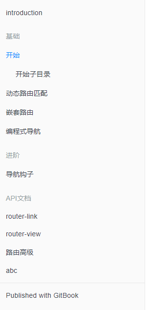

# 介绍 

本文档使用gitbook生成。

- 可以与github关联
- 可以从本地服务器启动

## 与github关联
- 打开https://www.gitbook.com/
- 点击Sign In 
- 点击Sign in with Github
- 点击\+ New Book
- 选择GITHUB，再选择相关的库即可(Select a Repository)
- Create Book

## 从本地服务器启动
- `npm install -g gitbook-cli`
- 创建一个存放该书的目录`git init mybook`
- 目录中有`README.md`和`SUMMARY.md`（重要）文件(README.md默认和gitbook中的introduction关联)
- 在`SUMMARY.md`编写文件结构(使用**markdown**语法)，如：
    ```
    # Summary

    * [introduction](introduce.md)

    ## 基础
    * [开始](README.md)
      - [开始子目录](childCatalog.md)
    * [动态路由匹配](er-ji-mu-lu-1.md)
    * [嵌套路由](er-ji-mu-lu-2.md)
    * 编程式导航

    ## 进阶
    * [导航钩子](yi-ji-mu-lu-2/er-ji-mu-lu-1.md)

    ## api文档
    * [router-link](http://www.baidu.com)
    * [router-view](er-ji-mu-lu-2.md)
    * [路由高级](http://www.baidu.com)
    - [abc]()

    ```
    其目录如下
    
    其中，一级目录(#)可以省略。二级目录(##)是导航栏。二级目录下是一篇篇具体的文章。然后文章也可以有更深层次的目录（如开始 -> 开始子目录)。其中，使用markdown语法时，用`*`或者`-`来标识一篇文章都可以。

-  每一个链接对应一个`.md`文件
- `gitbook serve`
- 打开`localhost:4000`
- 如果和github关联了，然后推送到github即可
